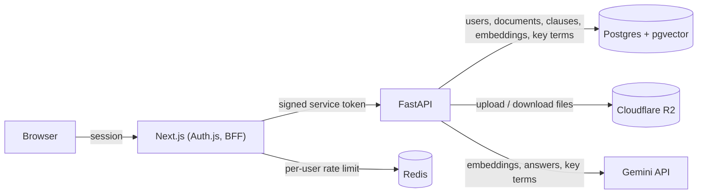

# Brief

Every clause, explained.

Brief reads a high stakes contract, an education loan, a lease, a job offer, and explains it in
plain English before you sign it. Ask it a question and it answers from the exact clause, with
the quote as proof. If the answer isn't in the document, it says so instead of guessing. It also
pulls out the terms that actually cost you money, and flagging anything unusual is next.

Status: in active development. [STATUS.md](STATUS.md) has the honest picture: what works today,
what is left, the numbers, and the expected finish. It is refreshed every week.

## Why this exists

Coming soon.

## How an answer is checked

An answer is only shown if its evidence holds up.

1. Your question finds the most relevant clauses, using keyword and meaning-based search together.
2. The model is told to answer from those clauses only, and to quote the passage it relied on.
3. Brief checks that each quote really appears in the clause it names, word for word. A quote that
   does not is thrown away.
4. If nothing survives the check, you get "I couldn't find this in the document" and no guess.

The text of an uploaded contract is treated as text to read, never as instructions to follow. Key
terms such as the interest rate or the late fee go through the same checks, and every number in a
term must also appear in its quote.

The key terms and the "Before you sign" questions are each read three times with fixed seeds and
kept by vote: a term or answer stays only if most of the reads found it. The same contract read twice
by a model can come out differently, and this makes the result steadier. The second check on the
questions judges each answer on its own, with two seeded looks and a third only if they disagree. When
it judged the answers together instead, its verdict on one depended on which others were in the group.
On one real 36 clause lease, four unseeded reads of the key terms changed four fields between runs and
four voted reads changed none, and six runs of the questions gave the same two answers every time,
including the $3,498 deposit. Steadier is not the same as more accurate, and this is one lease, so it is
a check and not a claim about contracts in general. The cost is time: a document now makes about ten
or more model calls, three for the key terms, three for the questions, and two or three for each
answer that is checked, so reading one can take from a few seconds to about a minute on the free tier.

Search and answers are measured, not assumed. The reports in [evals/](evals/) show the scores and
where they fall short.

## Architecture

The frontend is a Next.js app that handles Google sign-in and acts as a thin
backend-for-frontend, it never talks to Postgres or R2 directly. For each request it checks the
session, applies a per-user rate limit through Redis, then mints a short-lived signed token and
calls the FastAPI service. FastAPI owns everything else: user lookup, document storage in R2,
the ingestion pipeline (text extraction, or cleanup and OCR for photos, then splitting into clauses
and embedding them), hybrid search, grounded answers, and key-term extraction, all backed by
Postgres.

## Security

Brief holds private documents, so each layer limits what it can reach. What is in place today:

- **Sign-in and tokens.** Google sign-in through Auth.js. The browser never calls the API. The web
  server checks the session, then mints a token signed with a shared secret that expires after 60
  seconds, and the API rejects any token that is unsigned, uses another algorithm, has no expiry, or has
  expired. The secret should be at least 32 random characters.
- **Your documents are yours.** Every document request checks that it belongs to the caller, and
  someone else's document answers "not found", so its existence is not confirmed.
- **Uploads.** Files go straight to private storage with links that expire after five minutes. When an
  upload is confirmed, the real size and the first bytes are read from storage and checked against what
  the browser claimed. An empty or over-limit file, or one that is not the kind it says, is removed and
  refused. A second confirm for the same document is refused.
- **Limits.** 50 MB a file, 25 documents a person, 100 pages a document, and a per-user request limit
  of 30 a minute in Redis.
- **Deleting.** Deleting a document removes its file first and then its records, and deleting an
  account does the same for every document, one at a time, so a failure never leaves a record without
  its file or a file without a record. It can be repeated until it finishes.
- **Untrusted text.** The text of a contract is treated as data, never as instructions. The model has
  no tools to act with, and an answer is only shown if its quote is really in the document.
- **Web hardening.** Security headers on every response (no framing, no content sniffing, HTTPS only,
  no camera or microphone), and logs record document ids, not document text.
- **Dependencies.** A scan of the libraries that ship runs on every push and every Monday, and the
  build fails on a known high severity problem.

What is not done yet, so nobody assumes it is:

- **It is not deployed.** Putting it online needs HTTPS everywhere and an API that only the web app can
  reach, because the request limit lives in the web layer.
- **The text of your documents goes to Google's Gemini.** On the free tier Google's terms allow using
  that content to improve its products, and I believe paid billing removes that, so check the current
  terms and turn billing on before real people upload real documents.
- **PDFs from strangers are parsed by a library.** Brief checks the file type and size first, but a
  malicious PDF is still a risk worth reducing, for example by reading it in an isolated process.
- **No audit trail and no retention rule.** Nothing records who opened what, and documents are kept
  until their owner deletes them.
- **Encryption at rest** depends on the hosts. Confirm it for the database when it is deployed.
- **Build and lint tools** have two known high severity reports in their own dependencies. They are not
  part of what ships, and the scan above covers only what does.

## Limits and what a failed read says

Every page costs a reading call on a metered service, so there are limits: 50 MB a file, 25
documents a person (delete one to make room), and 100 pages a document. A refused file is turned away
before any page is read.

When a read fails, the document says why and what to do about it: no text found, a file that cannot
be opened (damaged or password protected), too many pages, a file that could not be fetched, the
reading service being busy, or the day's reading limit being reached. While a long document is being
read, its row shows how many parts are done so far.

## Running locally

You will need Docker, Python 3.12, Node 22 with pnpm, and Tesseract for reading photos of pages
(`brew install tesseract` on a Mac, `sudo apt-get install tesseract-ocr` on Ubuntu).

Start the shared services:

    docker compose up -d

This starts Postgres, with pgvector, and Redis.

Backend (from `api/`):

    python3.12 -m venv .venv
    source .venv/bin/activate
    pip install -r requirements-dev.txt
    alembic upgrade head
    uvicorn app.main:app --reload

Copy `api/.env.example` to `api/.env` first and fill in the real values (R2 credentials,
a Gemini API key, a JWT secret). The API refuses to start with a blank JWT secret, and with `ENVIRONMENT=production` it also
refuses the built-in development secret, a secret under 32 characters, and the development database
password.

Run the backend test suite (from `api/`, with the venv active and Postgres running):

    python -m pytest

Frontend (from `web/`): create `web/.env.local` with these variables, then start it.

    AUTH_SECRET=         # any long random string, for example from: openssl rand -base64 32
    AUTH_GOOGLE_ID=      # Google OAuth client ID
    AUTH_GOOGLE_SECRET=  # Google OAuth client secret
    SERVICE_JWT_SECRET=  # must match SERVICE_JWT_SECRET in api/.env
    BACKEND_URL=http://localhost:8000
    REDIS_URL=redis://localhost:6379

The Google OAuth client needs `http://localhost:3000/api/auth/callback/google` as an authorized
redirect URI.

    pnpm install
    pnpm dev

Frontend checks: `pnpm lint`, `pnpm test`, and `pnpm build`.

The evaluations call the real Gemini API and need Postgres running. Each one is a single command,
see [evals/README.md](evals/README.md).

## License

MIT
