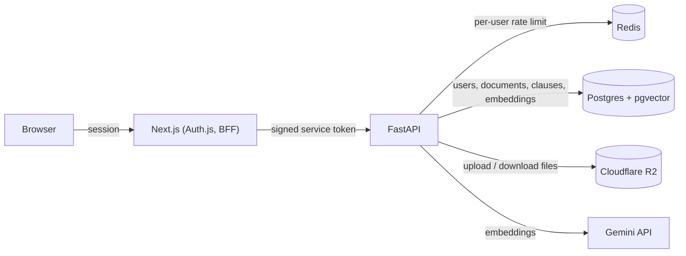

# Brief

Every clause, explained.

Brief reads a high stakes contract, an education loan, a lease, a job offer, and explains it in
plain English before you sign it. It pulls out the terms that actually cost you money, flags
anything unusual, and answers questions grounded in the exact clause they come from. If the answer
isn't in the document, it says so.

Status: in active development. [STATUS.md](STATUS.md) has the honest picture: what works today,
what is left, the numbers, and the expected finish. It is refreshed every week.

## Why this exists

Coming soon.

## Architecture

The frontend is a Next.js app that handles Google sign-in and acts as a thin
backend-for-frontend, it never talks to Postgres or R2 directly. It mints a short-lived
signed token per request and calls the FastAPI service, which owns everything else: user
lookup, per-user rate limiting via Redis, document storage in R2, and the ingestion
pipeline that turns an uploaded PDF into searchable clauses and embeddings in Postgres.

## Running locally

Start the shared services:

    docker compose up -d

This starts Postgres, with pgvector, and Redis.

Backend (from `api/`):

    python3.12 -m venv .venv
    source .venv/bin/activate
    pip install -r requirements-dev.txt
    alembic upgrade head
    uvicorn app.main:app --reload

Copy `api/.env.example` to `api/.env` first and fill in the real values (R2 credentials,
a Gemini API key, a JWT secret).

Run the backend test suite (from `api/`, with the venv active and Postgres running):

    python -m pytest

Frontend (from `web/`):

    pnpm install
    pnpm dev

## License

MIT
